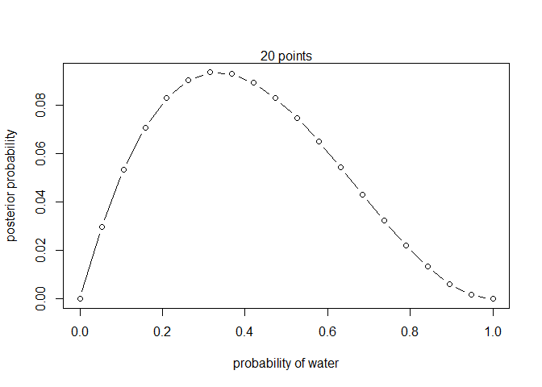
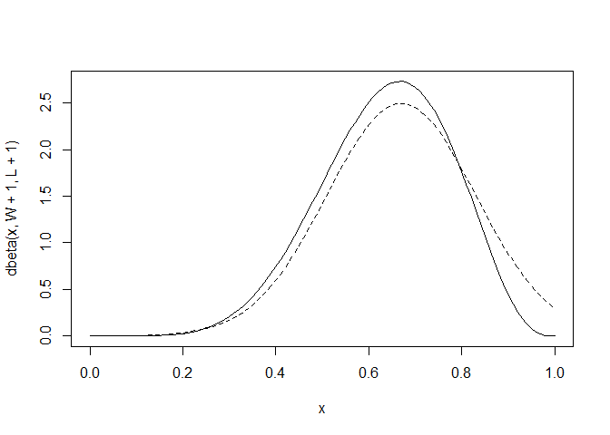
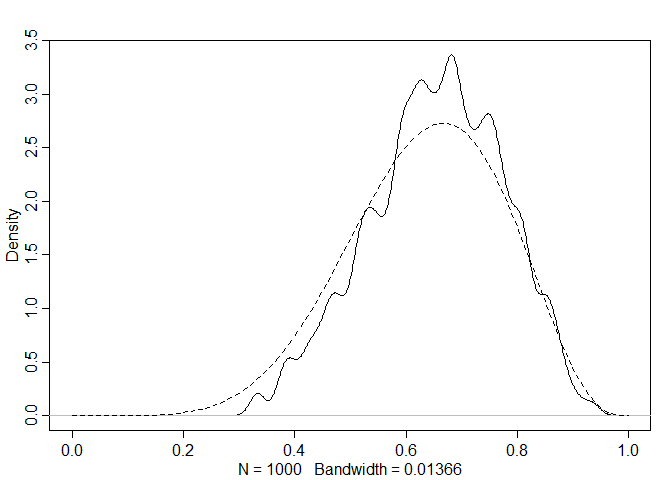
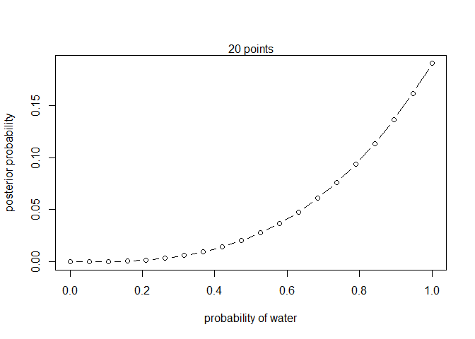
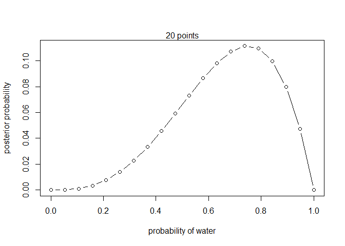
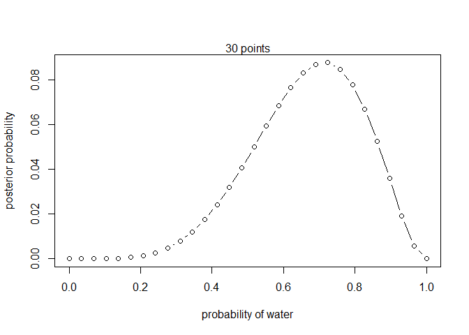
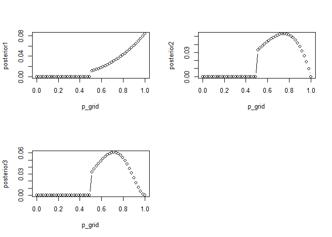

```r
library(rethinking)
```

```
## Loading required package: rstan
```

```
## Loading required package: StanHeaders
```

```
## Loading required package: ggplot2
```

```
## rstan (Version 2.21.3, GitRev: 2e1f913d3ca3)
```

```
## For execution on a local, multicore CPU with excess RAM we recommend calling
## options(mc.cores = parallel::detectCores()).
## To avoid recompilation of unchanged Stan programs, we recommend calling
## rstan_options(auto_write = TRUE)
```

```
## Do not specify '-march=native' in 'LOCAL_CPPFLAGS' or a Makevars file
```

```
## Loading required package: cmdstanr
```

```
## This is cmdstanr version 0.4.0
```

```
## - Online documentation and vignettes at mc-stan.org/cmdstanr
```

```
## - CmdStan path set to: C:/Users/ivantoriya/Documents/.cmdstanr/cmdstan-2.28.2
```

```
## - Use set_cmdstan_path() to change the path
```

```
## Loading required package: parallel
```

```
## rethinking (Version 2.21)
```

```
## 
## Attaching package: 'rethinking'
```

```
## The following object is masked from 'package:rstan':
## 
##     stan
```

```
## The following object is masked from 'package:stats':
## 
##     rstudent
```

**Grid Approximation**

$1$ Define the grid. This means you decide how many points to use in estimating the\
posterior, and then you make a list of the parameter values on the grid.

$2$ Compute the value of the prior at each parameter value on the grid.

$3$ Compute the likelihood at each parameter value.

$4$ Compute the unstandardized posterior at each parameter value, by multiplying the\
prior by the likelihood.

$5$ Finally, standardize the posterior, by dividing each value by the sum of all values.


```r
# define grid
p_grid <- seq( from=0 , to=1 , length.out=20 )

# define prior
prior <- rep( 1 , 20 )
# prior <- ifelse( p_grid < 0.5 , 0 , 1 )
# prior <- dbinom(1, size = 2, prob = p_grid)
# prior <- exp( -5*abs( p_grid - 0.5 ) )

# compute likelihood at each value in grid
likelihood <- dbinom( 1 , size= 3, prob=p_grid )

# compute product of likelihood and prior
unstd.posterior <- likelihood * prior

# standardize the posterior, so it sums to 1
posterior <- unstd.posterior / sum(unstd.posterior)


plot( p_grid , posterior  , type="b" ,
      xlab="probability of water" , ylab="posterior probability" )
mtext( "20 points" )
```

<!-- -->

**Quadratic Approximation**


```r
globe.qa <- quap(
  alist(
    W ~ dbinom( W+L ,p) , # binomial likelihood
    p ~ dunif(0,1) # uniform prior
) ,
data=list(W=6,L=3) )

# display summary of quadratic approximation
precis( globe.qa )
```

```
##        mean        sd      5.5%     94.5%
## p 0.6666664 0.1571338 0.4155362 0.9177967
```

Since we already know the posterior, let's compare to see how good the approximation is.


```r
# analytical calculation 2.7
W <- 6
L <- 3
curve( dbeta( x , W+1 , L+1 ) , from=0 , to=1 )
# quadratic approximation
curve( dnorm( x , 0.67 , 0.16 ) , lty=2 , add=TRUE )
```

<!-- -->

**Monte Carlo globe tossing example**


```r
n_samples <- 1000
p <- rep( NA , n_samples )
p[1] <- 0.5
W <- 6
L <- 3
for ( i in 2:n_samples ) {
p_new <- rnorm( 1 , p[i-1] , 0.1 )
if ( p_new < 0 ) p_new <- abs( p_new )
if ( p_new > 1 ) p_new <- 2 - p_new
q0 <- dbinom( W , W+L , p[i-1] )
q1 <- dbinom( W , W+L , p_new )
p[i] <- ifelse( runif(1) < q1/q0 , p_new , p[i-1] )
}

dens( p , xlim=c(0,1) )
curve( dbeta( x , W+1 , L+1 ) , lty=2 , add=TRUE )
```

<!-- -->

**2.5. Summary**

This chapter introduced the conceptual mechanics of Bayesian data analysis. The target of inference in Bayesian inference is a posterior probability distribution. Posterior probabilities state the relative numbers of ways each conjectured cause of the data could have produced the data. These relative numbers indicate plausibilities of the different conjectures. These plausibilities are updated in light of observations through Bayesian updating.

More mechanically, a Bayesian model is a composite of variables and distributional definitions for these variables. The probability of the data, often called the likelihood, provides the plausibility of an observation (data), given a fixed value for the parameters. The prior provides the plausibility of each possible value of the parameters, before accounting for the data. The rules of probability tell us that the logical way to compute the plausibilities, after accounting for the data, is to use Bayes' theorem. This results in the posterior distribution.

In practice, Bayesian models are fit to data using numerical techniques, like grid approximation, quadratic approximation, and Markov chain Monte Carlo. Each method imposes different trade-offs.

**2.6. Practice**

**2E1.** Which of the expressions below correspond to the statement: *the probability of rain on Monday*?

$1$ Pr(rain)\
**(2)** Pr(rain\|Monday)

$3$ Pr(Monday\|rain)\
**(4)** Pr(rain, Monday)/ Pr(Monday)

**Answer:**

**(2)** Pr(rain\|Monday) -- by it's definition (Probability of rain given it's Monday)

**and**

Pr (rain, Monday) = Pr(rain\|Monday) \* Pr(Monday)

This is like saying that the probability of rain **and** Monday is equal to the prob. of rain when it's Monday, times the prob. that it's Monday.

Then, Pr(rain\|Monday) = Pr(rain, Monday) / Pr(Monday) **(4)**

**2E2.** Which of the following statements corresponds to the expression: Pr(Monday\|rain)?

$1$ The probability of rain on Monday.

$2$ The probability of rain, given that it is Monday.\
**(3)** The probability that it is Monday, given that it is raining.

$4$ The probability that it is Monday and that it is raining.

**Answer:**

**(3)** The probability that it is Monday, given that it is raining.

**2E3.** Which of the expressions below correspond to the statement: *the probability that it is Monday,\
given that it is raining*?\
**(1)** Pr(Monday\|rain)

$2$ Pr(rain\|Monday)

$3$ Pr(rain\|Monday) Pr(Monday)\
**(4)** Pr(rain\|Monday) Pr(Monday)/ Pr(rain)

$5$ Pr(Monday\|rain) Pr(rain)/ Pr(Monday)

**Answer:**

**(1)** Pr(Monday\|rain)

Also,

Pr(Monday, rain) = Pr(Monday\|rain) \* Pr(rain) or

Pr(Monday, rain) = Pr(rain\|Monday) \* Pr(Monday)

Then, Pr(Monday\|rain) \* Pr(rain) = Pr(rain\|Monday) \* Pr(Monday)

Pr(Monday\|rain) = Pr(rain\|Monday) \* Pr(Monday) / Pr(rain) **(4)**

**2E4.** The Bayesian statistician Bruno de Finetti (1906--1985) began his 1973 book on probability theory with the declaration: "PROBABILITY DOES NOT EXIST." The capitals appeared in the original,\
so I imagine de Finetti wanted us to shout this statement. What he meant is that probability is a device for describing uncertainty from the perspective of an observer with limited knowledge; it has no\
objective reality. Discuss the globe tossing example from the chapter, in light of this statement. What\
does it mean to say "the probability of water is 0.7"?

**2M1.** Recall the globe tossing model from the chapter. Compute and plot the grid approximate\
posterior distribution for each of the following sets of observations. In each case, assume a uniform\
prior for p.

$1$ W, W, W

$2$ W, W, W, L

$3$ L, W, W, L, W, W, W

**Answers:**

**(1) W, W, W**


```r
# define grid
p_grid <- seq( from=0 , to=1 , length.out=20 )

# define prior
prior <- rep( 1 , 20 )

# compute likelihood at each value in grid
W <- 3
L <- 0

likelihood <- dbinom( W , size=W+L, prob=p_grid )

# compute product of likelihood and prior
unstd.posterior <- likelihood * prior

# standardize the posterior, so it sums to 1
posterior <- unstd.posterior / sum(unstd.posterior)


plot( p_grid , posterior  , type="b" ,
      xlab="probability of water" , ylab="posterior probability" )
mtext( "20 points" )
```

<!-- -->

**(2) W, W, W, L**


```r
# define grid
p_grid <- seq( from=0 , to=1 , length.out=20 )

# define prior
prior <- rep( 1 , 20 )

# compute likelihood at each value in grid
W <- 3
L <- 1

likelihood <- dbinom( W , size=W+L, prob=p_grid )

# compute product of likelihood and prior
unstd.posterior <- likelihood * prior

# standardize the posterior, so it sums to 1
posterior <- unstd.posterior / sum(unstd.posterior)


plot( p_grid , posterior  , type="b" ,
      xlab="probability of water" , ylab="posterior probability" )
mtext( "20 points" )
```

<!-- -->

**(3) L, W, W, L, W, W, W**


```r
# define grid
p_grid <- seq( from=0 , to=1 , length.out=30 )

# define prior
prior <- rep( 1 , 30 )

# compute likelihood at each value in grid
W <- 5
L <- 2

likelihood <- dbinom( W , size=W+L, prob=p_grid )

# compute product of likelihood and prior
unstd.posterior <- likelihood * prior

# standardize the posterior, so it sums to 1
posterior <- unstd.posterior / sum(unstd.posterior)


plot( p_grid , posterior  , type="b" ,
      xlab="probability of water" , ylab="posterior probability" )
mtext( "30 points" )
```

<!-- -->

**2M2.** Now assume a prior for p that is equal to zero when p \< 0.5 and is a positive constant when\
p ≥ 0.5. Again compute and plot the grid approximate posterior distribution for each of the sets of\
observations in the problem just above.


```r
# define grid
p_grid <- seq( from=0 , to=1 , length.out=50 )

# define prior
# prior <- rep( 1 , 20 )
prior <- ifelse( p_grid < 0.5 , 0 , 1 )
# prior <- dbinom(1, size = 2, prob = p_grid)
# prior <- exp( -5*abs( p_grid - 0.5 ) )

# compute likelihood at each value in grid
likelihood1 <- dbinom( 3 , size=3, prob=p_grid )
likelihood2 <- dbinom( 3 , size=4, prob=p_grid )
likelihood3 <- dbinom( 5 , size=7, prob=p_grid )

# compute product of likelihood and prior
unstd.posterior1 <- likelihood1 * prior
unstd.posterior2 <- likelihood2 * prior
unstd.posterior3 <- likelihood3 * prior

# standardize the posterior, so it sums to 1
posterior1 <- unstd.posterior1 / sum(unstd.posterior1)
posterior2 <- unstd.posterior2 / sum(unstd.posterior2)
posterior3 <- unstd.posterior3 / sum(unstd.posterior3)

par(mfrow = c(2,2))

plot( p_grid , posterior1  , type="b")
plot( p_grid , posterior2  , type="b")
plot( p_grid , posterior3  , type="b")
```

<!-- -->


**2M3.** Suppose there are two globes, one for Earth and one for Mars. The Earth globe is 70% covered\
in water. The Mars globe is 100% land. Further suppose that one of these globes---you don't know\
which---was tossed in the air and produced a "land" observation. Assume that each globe was equally\
likely to be tossed. Show that the posterior probability that the globe was the Earth, conditional on\
seeing "land" (Pr(Earth\|land)), is 0.23.

**Answer:**


```r
Pr_water_Earth <- 0.7
Pr_land_Earth <- 0.3

Pr_land_Mars <- 1
Pr_water_Mars <- 0

Pr_Earth <- 0.5
Pr_Mars <- 0.5

Pr_land_and_Earth <- Pr_land_Earth * Pr_Earth
Pr_land_and_Mars <- Pr_land_Mars * Pr_Mars

(Pr_Earth_land <- Pr_land_and_Earth / sum(Pr_land_and_Earth, Pr_land_and_Mars))
```

```
## [1] 0.2307692
```
