chapter_3
================

``` r
library(ggplot2)
library(rethinking)
```

    ## Loading required package: rstan

    ## Loading required package: StanHeaders

    ## rstan (Version 2.21.3, GitRev: 2e1f913d3ca3)

    ## For execution on a local, multicore CPU with excess RAM we recommend calling
    ## options(mc.cores = parallel::detectCores()).
    ## To avoid recompilation of unchanged Stan programs, we recommend calling
    ## rstan_options(auto_write = TRUE)

    ## Do not specify '-march=native' in 'LOCAL_CPPFLAGS' or a Makevars file

    ## Loading required package: cmdstanr

    ## This is cmdstanr version 0.4.0

    ## - Online documentation and vignettes at mc-stan.org/cmdstanr

    ## - CmdStan path set to: C:/Users/ivantoriya/Documents/.cmdstanr/cmdstan-2.28.2

    ## - Use set_cmdstan_path() to change the path

    ## Loading required package: parallel

    ## rethinking (Version 2.21)

    ## 
    ## Attaching package: 'rethinking'

    ## The following object is masked from 'package:rstan':
    ## 
    ##     stan

    ## The following object is masked from 'package:stats':
    ## 
    ##     rstudent

``` r
Pr_Positive_Vampire <- 0.95
Pr_Positive_Mortal <- 0.01
Pr_Vampire <- 0.001
Pr_Positive <- Pr_Positive_Vampire * Pr_Vampire +
Pr_Positive_Mortal * ( 1 - Pr_Vampire )
( Pr_Vampire_Positive <- Pr_Positive_Vampire*Pr_Vampire / Pr_Positive )
```

    ## [1] 0.08683729

``` r
Pr_Vampire <- 0.08683729
Pr_Positive <- Pr_Positive_Vampire * Pr_Vampire +
Pr_Positive_Mortal * ( 1 - Pr_Vampire )
( Pr_Vampire_Positive <- Pr_Positive_Vampire*Pr_Vampire / Pr_Positive )
```

    ## [1] 0.9003392

``` r
Pr_Vampire <- 0.9003392
Pr_Positive <- Pr_Positive_Vampire * Pr_Vampire +
Pr_Positive_Mortal * ( 1 - Pr_Vampire )
( Pr_Vampire_Positive <- Pr_Positive_Vampire*Pr_Vampire / Pr_Positive )
```

    ## [1] 0.9988362

``` r
Pr_Vampire <- 0.9988362
Pr_Positive <- Pr_Positive_Vampire * Pr_Vampire +
Pr_Positive_Mortal * ( 1 - Pr_Vampire )
( Pr_Vampire_Positive <- Pr_Positive_Vampire*Pr_Vampire / Pr_Positive )
```

    ## [1] 0.9999877

``` r
Pr_Vampire <- 0.9999877
Pr_Positive <- Pr_Positive_Vampire * Pr_Vampire +
Pr_Positive_Mortal * ( 1 - Pr_Vampire )
( Pr_Vampire_Positive <- Pr_Positive_Vampire*Pr_Vampire / Pr_Positive )
```

    ## [1] 0.9999999

``` r
p_grid <- seq( from=0 , to=1 , length.out=1000 )
prob_p <- rep( 1 , 1000 )
prob_data <- dbinom( 6 , size=9 , prob=p_grid )
posterior <- prob_data * prob_p
posterior <- posterior / sum(posterior)

samples <- sample( p_grid , prob=posterior , size=1e4 , replace=TRUE )

plot( samples, pch=16, col=rgb(red=0.2, green=0.2, blue=1.0, alpha=0.2) )
```

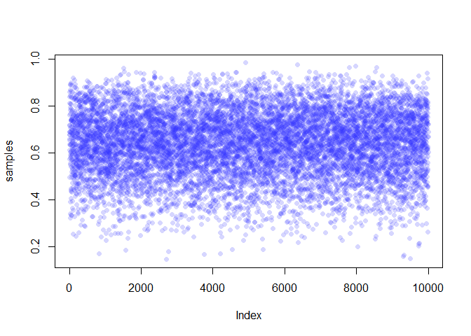<!-- -->

``` r
dens( samples )
```

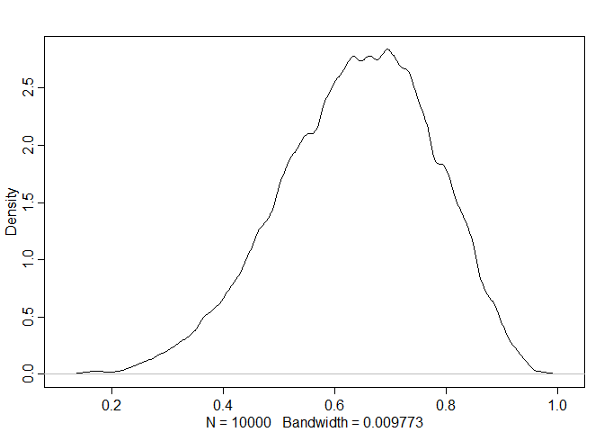<!-- -->

**3.5. Practice**

**Easy.** The Easy problems use the samples from the posterior
distribution for the globe tossing example. This code will give you a
specific set of samples, so that you can check your answers exactly.

``` r
p_grid <- seq( from=0 , to=1 , length.out=1000 )
prior <- rep( 1 , 1000 )
likelihood <- dbinom( 6 , size=9 , prob=p_grid )
posterior <- likelihood * prior
posterior <- posterior / sum(posterior)
set.seed(100)
samples <- sample( p_grid , prob=posterior , size=1e4 , replace=TRUE )

hist(samples)
```

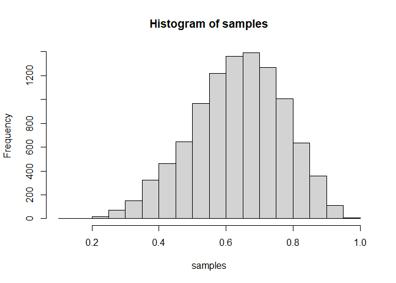<!-- -->

Use the values in *samples* to answer the questions that follow.

**3E1.** How much posterior probability lies below p = 0.2?

``` r
sum(samples[p_grid < 0.2]) / 1e4
```

    ## [1] 0.1258482

**3E2.** How much posterior probability lies above p = 0.8?

``` r
sum(samples[p_grid > 0.8]) / 1e4
```

    ## [1] 0.1281592

**3E3.** How much posterior probability lies between p = 0.2 and p =
0.8?

``` r
sum(samples[p_grid > 0.2 & p_grid < 0.8]) / 1e4
```

    ## [1] 0.3807948

**3E4.** 20% of the posterior probability lies below which value of p?

``` r
quantile(samples, 0.2)
```

    ##       20% 
    ## 0.5185185

**3E5.** 20% of the posterior probability lies above which value of p?

``` r
quantile(samples, 0.8)
```

    ##       80% 
    ## 0.7557558

**3E6.** Which values of p contain the narrowest interval equal to 66%
of the posterior probability?

``` r
HPDI(samples, 0.66)
```

    ##     |0.66     0.66| 
    ## 0.5085085 0.7737738

**3E7.** Which values of p contain 66% of the posterior probability,
assuming equal posterior probability both below and above the interval?

``` r
PI(samples, 0.66)
```

    ##       17%       83% 
    ## 0.5025025 0.7697698

**3M1.** Suppose the globe tossing data had turned out to be 8 water in
15 tosses. Construct the posterior distribution, using grid
approximation. Use the same flat prior as before.

``` r
p_grid <- seq( from=0 , to=1 , length.out=1000 )
prior <- rep( 1 , 1000 )
likelihood <- dbinom( 8 , size=15 , prob=p_grid )
posterior <- likelihood * prior
posterior <- posterior / sum(posterior)
set.seed(100)
samples <- sample( p_grid , prob=posterior , size=1e4, replace=TRUE)
hist(samples)
```

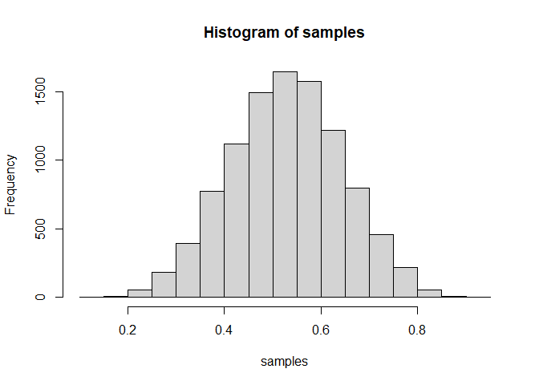<!-- -->

``` r
plot(p_grid, posterior)
```

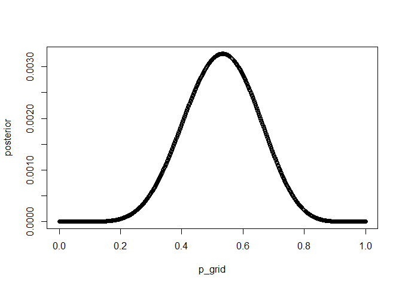<!-- -->

**3M2.** Draw 10,000 samples from the grid approximation from above.
Then use the samples to calculate the 90% HPDI for p.

``` r
HPDI(samples, 0.9)
```

    ##      |0.9      0.9| 
    ## 0.3343343 0.7217217

**3M3.** Construct a posterior predictive check for this model and data.
This means simulate the distribution of samples, averaging over the
posterior uncertainty in p. What is the probability of observing 8 water
in 15 tosses?

``` r
p_grid <- seq( from=0 , to=1 , length.out=1000 )
prior <- rep( 1 , 1000 )
likelihood <- dbinom( 8 , size=15 , prob=p_grid )
posterior <- likelihood * prior
posterior <- posterior / sum(posterior)
set.seed(100)
samples <- sample( p_grid , prob=posterior , size=1e4, replace=TRUE)

w15 <- rbinom(1e4, size=15, prob=samples)

table(w15)/1e4
```

    ## w15
    ##      0      1      2      3      4      5      6      7      8      9     10 
    ## 0.0004 0.0037 0.0125 0.0265 0.0508 0.0861 0.1155 0.1338 0.1499 0.1397 0.1158 
    ##     11     12     13     14     15 
    ## 0.0806 0.0475 0.0249 0.0105 0.0018

``` r
plot(table(w15)/1e4)
```

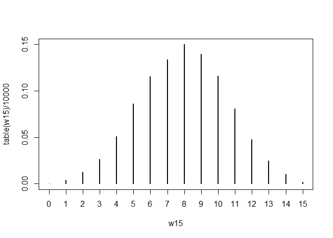<!-- -->

**3M4.** Using the posterior distribution constructed from the new
(8/15) data, now calculate the probability of observing 6 water in 9
tosses.

``` r
w9 <- rbinom(1e4, size=9, prob=samples)
table(w9)/1e4
```

    ## w9
    ##      0      1      2      3      4      5      6      7      8      9 
    ## 0.0042 0.0276 0.0753 0.1363 0.1901 0.2074 0.1842 0.1107 0.0520 0.0122

``` r
plot(table(w9)/1e4)
```

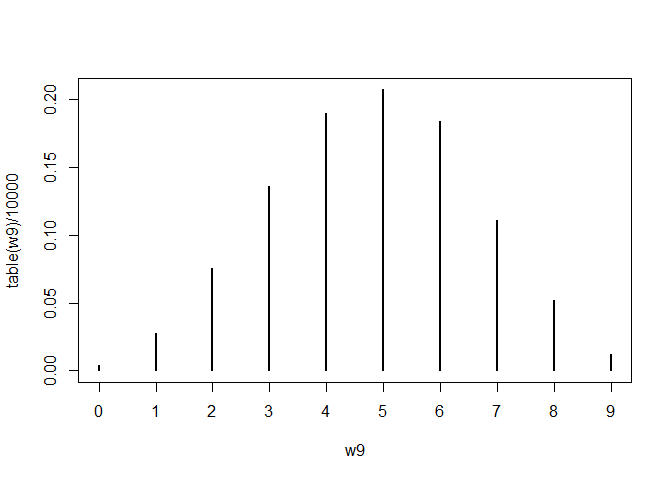<!-- -->

**3M5.** Start over at 3M1, but now use a prior that is zero below p =
0.5 and a constant above p = 0.5. This corresponds to prior information
that a majority of the Earth’s surface is water. Repeat each problem
above and compare the inferences. What difference does the better prior
make? If it helps, compare inferences (using both priors) to the true
value p = 0.7.

``` r
p_grid <- seq( from=0 , to=1 , length.out=1000 )
prior <- ifelse( p_grid < 0.5 , 0 , 1 )
likelihood <- dbinom( 8 , size=15 , prob=p_grid )
posterior <- likelihood * prior
posterior <- posterior / sum(posterior)
set.seed(100)
samples <- sample( p_grid , prob=posterior , size=1e4, replace=TRUE)
hist(samples)
```

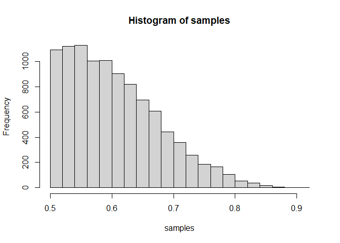<!-- -->

``` r
plot(p_grid, posterior, type='b')
```

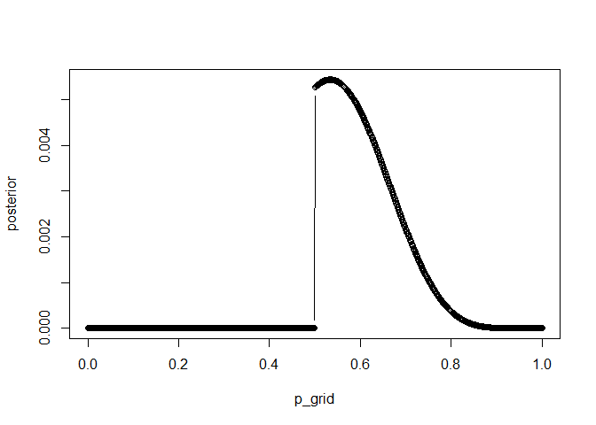<!-- -->

**3M5.2.** Draw 10,000 samples from the grid approximation from above.
Then use the samples to calculate the 90% HPDI for p.

``` r
HPDI(samples, 0.9)
```

    ##      |0.9      0.9| 
    ## 0.5005005 0.7097097

**3M5.3.** Construct a posterior predictive check for this model and
data. This means simulate the distribution of samples, averaging over
the posterior uncertainty in p. What is the probability of observing 8
water in 15 tosses?

``` r
w15 <- rbinom(1e4, size=15, prob=samples)

table(w15)/1e4
```

    ## w15
    ##      1      2      3      4      5      6      7      8      9     10     11 
    ## 0.0002 0.0007 0.0035 0.0132 0.0347 0.0684 0.1081 0.1630 0.1776 0.1667 0.1273 
    ##     12     13     14     15 
    ## 0.0769 0.0388 0.0184 0.0025

``` r
plot(table(w15)/1e4)
```

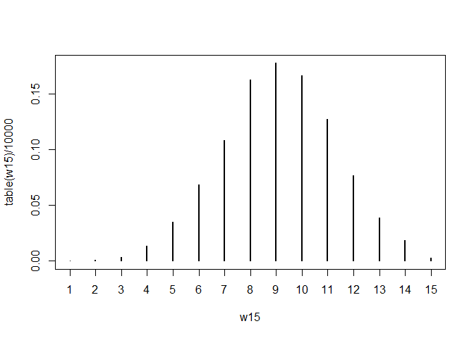<!-- -->

**3M5.4.** Using the posterior distribution constructed from the new
(8/15) data, now calculate the probability of observing 6 water in 9
tosses.

``` r
w9 <- rbinom(1e4, size=9, prob=samples)
table(w9)/1e4
```

    ## w9
    ##      0      1      2      3      4      5      6      7      8      9 
    ## 0.0004 0.0052 0.0302 0.0813 0.1591 0.2250 0.2353 0.1617 0.0821 0.0197

``` r
plot(table(w9)/1e4)
```

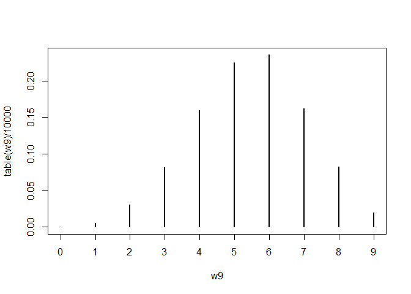<!-- -->

**3M6.** Suppose you want to estimate the Earth’s proportion of water
very precisely. Specifically, you want the 99% percentile interval of
the posterior distribution of p to be only 0.05 wide. This means the
distance between the upper and lower bound of the interval should be
0.05. How many times will you have to toss the globe to do this?
