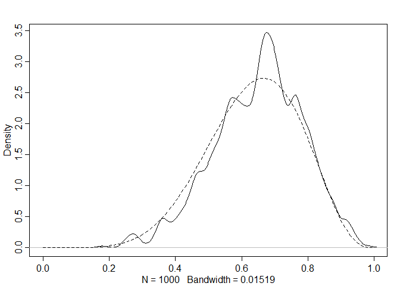

Chapter 2
================

``` r
library(rethinking)
```

    ## Загрузка требуемого пакета: rstan

    ## Загрузка требуемого пакета: StanHeaders

    ## Загрузка требуемого пакета: ggplot2

    ## rstan (Version 2.21.2, GitRev: 2e1f913d3ca3)

    ## For execution on a local, multicore CPU with excess RAM we recommend calling
    ## options(mc.cores = parallel::detectCores()).
    ## To avoid recompilation of unchanged Stan programs, we recommend calling
    ## rstan_options(auto_write = TRUE)

    ## Do not specify '-march=native' in 'LOCAL_CPPFLAGS' or a Makevars file

    ## Загрузка требуемого пакета: parallel

    ## rethinking (Version 2.13)

    ## 
    ## Присоединяю пакет: 'rethinking'

    ## Следующий объект скрыт от 'package:stats':
    ## 
    ##     rstudent

**Grid Approximation**

1 Define the grid. This means you decide how many points to use in
estimating the  
posterior, and then you make a list of the parameter values on the grid.

2 Compute the value of the prior at each parameter value on the grid.

3 Compute the likelihood at each parameter value.

4 Compute the unstandardized posterior at each parameter value, by
multiplying the  
prior by the likelihood.

5 Finally, standardize the posterior, by dividing each value by the sum
of all values.

``` r
# define grid
p_grid <- seq( from=0 , to=1 , length.out=20 )

# define prior
prior <- rep( 1 , 20 )
# prior <- ifelse( p_grid < 0.5 , 0 , 1 )
# prior <- dbinom(1, size = 2, prob = p_grid)
# prior <- exp( -5*abs( p_grid - 0.5 ) )

# compute likelihood at each value in grid
likelihood <- dbinom( 1 , size= 3, prob=p_grid )

# compute product of likelihood and prior
unstd.posterior <- likelihood * prior

# standardize the posterior, so it sums to 1
posterior <- unstd.posterior / sum(unstd.posterior)


plot( p_grid , posterior  , type="b" ,
      xlab="probability of water" , ylab="posterior probability" )
mtext( "100 points" )
```

<!-- -->

**Quadratic Approximation**

``` r
globe.qa <- quap(
  alist(
    W ~ dbinom( W+L ,p) , # binomial likelihood
    p ~ dunif(0,1) # uniform prior
) ,
data=list(W=6,L=3) )

# display summary of quadratic approximation
precis( globe.qa )
```

    ##        mean        sd      5.5%     94.5%
    ## p 0.6666663 0.1571339 0.4155361 0.9177966

Since we already know the posterior, let’s compare to see how good the
approximation is.

``` r
# analytical calculation 2.7
W <- 6
L <- 3
curve( dbeta( x , W+1 , L+1 ) , from=0 , to=1 )
# quadratic approximation
curve( dnorm( x , 0.67 , 0.16 ) , lty=2 , add=TRUE )
```

<!-- -->

**Monte Carlo globe tossing example**

``` r
n_samples <- 1000
p <- rep( NA , n_samples )
p[1] <- 0.5
W <- 6
L <- 3
for ( i in 2:n_samples ) {
p_new <- rnorm( 1 , p[i-1] , 0.1 )
if ( p_new < 0 ) p_new <- abs( p_new )
if ( p_new > 1 ) p_new <- 2 - p_new
q0 <- dbinom( W , W+L , p[i-1] )
q1 <- dbinom( W , W+L , p_new )
p[i] <- ifelse( runif(1) < q1/q0 , p_new , p[i-1] )
}

dens( p , xlim=c(0,1) )
curve( dbeta( x , W+1 , L+1 ) , lty=2 , add=TRUE )
```

<!-- -->

**2.5. Summary**

This chapter introduced the conceptual mechanics of Bayesian data
analysis. The target of inference in Bayesian inference is a posterior
probability distribution. Posterior probabilities state the relative
numbers of ways each conjectured cause of the data could have produced
the data. These relative numbers indicate plausibilities of the
different conjectures. These plausibilities are updated in light of
observations through Bayesian updating.

More mechanically, a Bayesian model is a composite of variables and
distributional definitions for these variables. The probability of the
data, often called the likelihood, provides the plausibility of an
observation (data), given a fixed value for the parameters. The prior
provides the plausibility of each possible value of the parameters,
before accounting for the data. The rules of probability tell us that
the logical way to compute the plausibilities, after accounting for the
data, is to use Bayes’ theorem. This results in the posterior
distribution.

In practice, Bayesian models are fit to data using numerical techniques,
like grid approximation, quadratic approximation, and Markov chain Monte
Carlo. Each method imposes different trade-offs.

**2.6. Practice**
